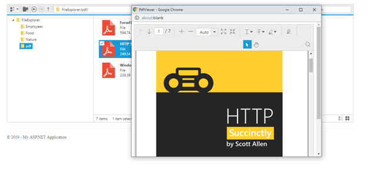

# Preview pdf files in EJ1 FileExplorer using pdfviewer control

This example demonstrates how to preview pdf files in EJ1 FileExplorer using pdfViewer control. This can be achieved by passing the path of the file opened to the pdfviewer control with service url pointing to the PdfViewer controller. Also, you need to include the pdfviewer controller which processes the file path and opens the file in a new window. 

## How to run this application?

To run this application, you need to first clone the `ej1-file-explorer-preview-pdf-files-using-pdfviewer` repository and then navigate to its appropriate path where it has been located in your system.

To do so, open the command prompt and run the below commands one after the other.

```
git clone https://github.com/SyncfusionExamples/ej1-file-explorer-preview-pdf-files-using-pdfviewer FE_PDF_Preview
cd FE_PDF_Preview
```

## Running application

Once cloned, open solution file in visual studio.Then build the project after restoring the nuget packages and run it.

## Final Output

